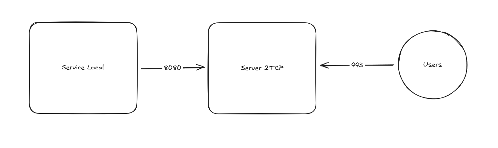

# 2TCP - Tunnel TCP



Un tunnel TCP simple et efficace conçu pour fonctionner derrière un reverse proxy. Ce projet fournit un moyen de relayer le trafic TCP d'un serveur public vers un service local, même lorsque le service local se trouve derrière un NAT ou un pare-feu.

## ✨ Fonctionnalités

- **Tunneling TCP** : Relaye les connexions TCP d'un point d'accès public vers un service sur un réseau local.
- **Architecture Client-Serveur** : Un serveur central gère les connexions publiques et un client léger s'exécute sur le réseau local.
- **Multiplexage de Connexions** : Utilise une connexion de contrôle persistante pour gérer plusieurs connexions de tunnel, ce qui le rend compatible avec les reverse proxies.
- **Gestion des Connexions** : Suit les connexions actives et nettoie les connexions obsolètes ou en attente.
- **Reconnexion Automatique** : Le client tente de se reconnecter automatiquement au serveur en cas de déconnexion.
- **Journalisation Configurable** : Niveaux de log ajustables (`debug`, `info`, `warn`, `error`) pour le développement et la production.
- **Détection de Health Check** : Le serveur peut répondre aux requêtes HTTP GET de base (comme les health checks des reverse proxies) sans interrompre la connexion de tunnel.

## 🚀 Utilisation

### Côté Serveur

Exécutez la commande suivante sur votre serveur public :

```sh
main.go server [service_port] --log-level [level]
```

- `[service_port]` : **(Obligatoire)** Le port TCP public qui recevra le trafic à tunneler.
- `--log-level` : **(Optionnel)** Niveau de verbosité des logs (`debug`, `info`, `warn`, `error`). Défaut : `info`.

#### Exemple :

```sh
main.go server 4040 --log-level debug
```

Le serveur écoutera également les connexions de contrôle sur le port **8080**.

### Côté Client

Exécutez la commande suivante sur la machine hébergeant le service local :

```sh
main.go client [local_port] [server_address] --log-level [level]
```

- `[local_port]` : **(Obligatoire)** Port local du service à exposer (ex: 3000).
- `[server_address]` : **(Obligatoire)** Adresse IP ou nom de domaine du serveur public.
- `--log-level` : **(Optionnel)** Niveau de log.

#### Exemple :

```sh
main.go client 8080 example.com
```

Une fois connecté, tout le trafic envoyé à l’adresse publique sera redirigé vers `localhost:8080`.

En cas de déconnexion, le client tente automatiquement de se reconnecter toutes les 5 secondes.
